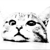

<a href="#education">Education</a>
<a href="#research-direction">Research Direction</a>
<a href="#academic-role">Academic Role</a>
<a href="#research-project">Research Project</a>

    <a href="./publication/publications">Publications</a>
    

        <a href="./publication/publications-2025">2025</a>
        <a href="./publication/publications-2024">2024</a>
        <a href="./publication/publications-2023">2023</a>
        <a href="./publication/publications-2022">2022</a>
        <a href="./publication/publications-2021">2021</a>
        <a href="./publication/publications-2020">2020</a>
    

<a href="#academic-exchange">Academic Exchange</a>
<a href="#honour">Honour</a>
<a href="#professional-skills">Professional Skills</a>
<a href="./index-zh">中文（更新中）</a>
<a>English</a>

    <a>Yuyan Jiang</a>
    <a>Lanzhou, Gansu, China</a>
    📧<a href="mailto:jiangyuyancite@163.com">jiangyuyancite@163.com</a>
    👨‍🎓 <a href="https://scholar.google.com/citations?user=QTCEilEAAAAJ">Google Scholar</a>
    <a>WeChat & 📱: +86 13372007365</a>

  <!-- 左侧头像区域 -->
  

    
  

  
  <!-- 右侧个人简介区域 -->

    <h2 style="margin-top: 0;">Yuyan Jiang</h2>
    
<strong>Not a cat, but a PhD student!</strong>

  

---

## Education

| Degree | University | Major | Time |
| :-: | :-: | :-: | :-: |
|👨**PhD**| University of Chinese Academy of Sciences | Information Science | 2024 - 2027 |  
|👦**MPhil**| Henan Medical University | Library, Information and Archives Management | 2021 - 2024 |  
|👶**Bachelor**| Nanjing University Jinling College | Information Management and Information Systems | 2017 - 2021 |  

## Research Direction  
**1.** Scientometrics  
**2.** Journal Publishing  
**3.** Open Science & Scientific Data  
**4.** Peer Review & Research Ethic  
**5.** Digital Humanity  
**6.** Digital Library & Reading Promotion  
